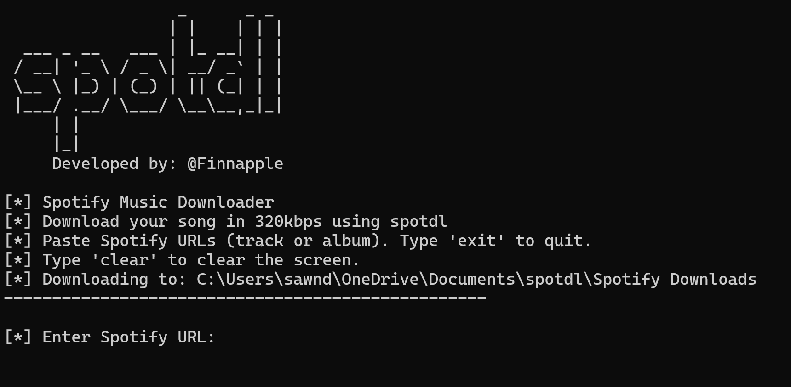

## SuperSpotdl

A Python-based Spotify downloader that fetches **high-quality audio** (MP3 or FLAC) from Spotify tracks and albums.  
It uses the Spotify API for track information, YouTube for audio sources, and yt-dlp for downloading.  
Supports **metadata embedding** (ID3 / FLAC tags), including album art.  
Perfect for building an **offline, high-quality music collection**.



---

## Setup Instructions

Follow the instructions below to set up the virtual environment and install the necessary dependencies for your operating system.

## Compatible with **Linux**, **macOS**, and **Windows**.

## For Linux & macOS:
```bash
python3 -m venv spotify_venv
source spotify_venv/bin/activate
pip install spotdl
pip install requests
pip install -r requirements.txt
```

## For Windows:
```bat
python -m venv spotify_venv
call spotify_venv\Scripts\activate
pip install spotdl
pip install requests
pip install -r requirements.txt
```

## Or just do this instead:
```bash
chmod +x setup.sh   # Give execute permission (for Linux)
./setup.sh          # Run the script (for macOS)
```

## For Windows:
```bat
Simply run the batch file to automatically create the virtual environment and install all dependencies.
```

## Usage:
After setting up and activating the virtual environment, you can run spotdl scripts as needed.
- On Linux/macOS, use `python3` to ensure Python 3 is used.
- Activation commands differ between Windows (`spotify_venv\Scripts\activate`) and Linux/macOS (`source spotify_venv/bin/activate`).
- Ensure that Python and pip are installed on your system before starting.
